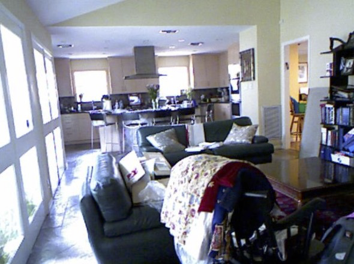
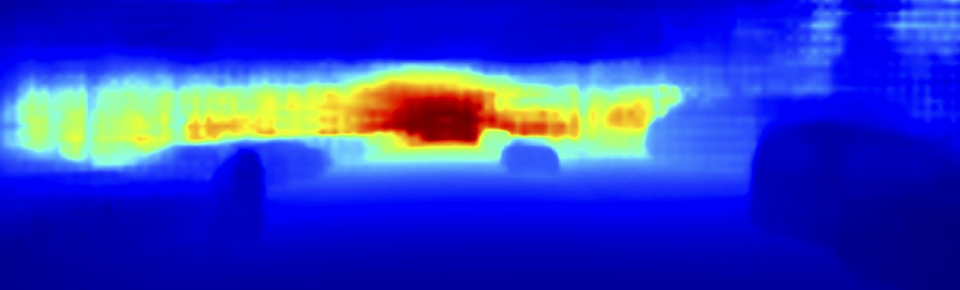
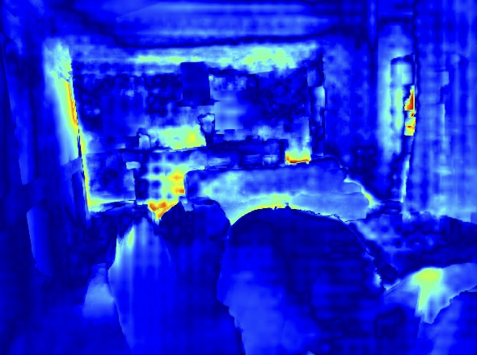

## ConOR: Uncertainty Quantification in Depth Estimation via Constrained Ordinal Regression

This repository contains the implementation of ConOR on synthetic data and benchmark dataset described in
[D. Hu, L. Peng, T. Chu, X. Zhang, Y. Mao, H. Bondell, and M. Gong: Uncertainty Quantification in Depth Estimation via Constrained Ordinal Regression. European Conference on Computer Vision (ECCV) 2022. ](https://www.ecva.net/papers/eccv_2022/papers_ECCV/papers/136620229.pdf)

Supplementary material can be found [here.](https://www.ecva.net/papers/eccv_2022/papers_ECCV/papers/136620229-supp.pdf)

| Input Image | Depth Estimation |
:-------------------------:|:-------------------------:
  |  
| Predictive Uncertainty | Estimation Error \(vs. GT\)|
  |  


If you find it useful, please consider citing:
```
@inproceedings{hu2022uncertainty,
  title={Uncertainty Quantification in Depth Estimation via Constrained Ordinal Regression},
  author={Hu, Dongting and Peng, Liuhua and Chu, Tingjin and Zhang, Xiaoxing and Mao, Yinian and Bondell, Howard and Gong, Mingming},
  booktitle={Computer Vision--ECCV 2022: 17th European Conference, Tel Aviv, Israel, October 23--27, 2022, Proceedings, Part II},
  pages={237--256},
  year={2022},
  organization={Springer}
}
```
